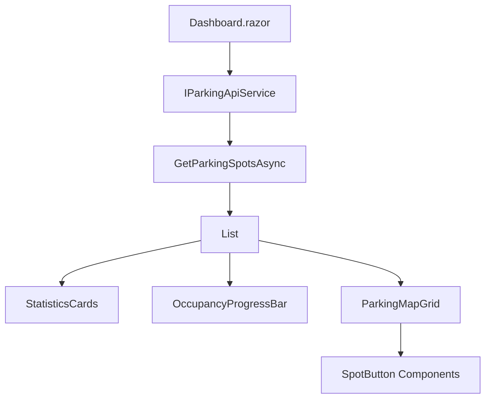

# Documento de Design - Reestruturação do Dashboard

## Visão Geral

Este documento descreve o design técnico para a reestruturação completa do dashboard do sistema de estacionamento. O objetivo é substituir o componente de gráfico Chart.js problemático por visualizações mais eficazes: uma barra de progresso para ocupação e um mapa visual do estacionamento inspirado no aplicativo desktop.

## Arquitetura

### Estrutura de Componentes

```
Dashboard.razor
├── StatisticsCards (existente - mantido)
├── OccupancyProgressBar (novo)
├── ParkingMapGrid (novo)
└── LoadingIndicators (melhorado)
```

### Fluxo de Dados



## Componentes e Interfaces

### 1. OccupancyProgressBar Component

**Responsabilidade:** Exibir visualmente a taxa de ocupação atual do estacionamento.

**Props:**
- `OccupiedSpots` (int): Número de vagas ocupadas
- `TotalSpots` (int): Número total de vagas
- `OccupancyRate` (double): Taxa de ocupação calculada

**Comportamento:**
- Calcula automaticamente a porcentagem de ocupação
- Aplica cores baseadas em thresholds:
  - Verde: < 50% ocupação
  - Amarelo: 50-80% ocupação  
  - Vermelho: > 80% ocupação
- Exibe valor numérico e visual simultaneamente

**Implementação:**
```razor
<MudProgressLinear Color="@GetProgressColor()" 
                   Value="@(OccupancyRate * 100)" 
                   Size="Size.Large" 
                   Class="mb-2"/>
<MudText Typo="Typo.body1" Align="Align.Center">
    @OccupiedSpots de @TotalSpots vagas ocupadas (@OccupancyRate.ToString("P0"))
</MudText>
```

### 2. ParkingMapGrid Component

**Responsabilidade:** Exibir um mapa visual do estacionamento mostrando todas as vagas.

**Props:**
- `ParkingSpots` (List<ParkingSpotDto>): Lista de todas as vagas
- `OnSpotClick` (EventCallback<ParkingSpotDto>): Callback para clique em vaga

**Layout:**
- Grid responsivo com 10 colunas (similar ao desktop)
- Cada vaga representada por um botão/card
- Cores distintas para vagas livres (verde) e ocupadas (vermelho)
- Hover effects e transições suaves

**Implementação:**
```razor
<MudGrid Spacing="1" Class="parking-map">
    @foreach (var spot in ParkingSpots)
    {
        <MudItem xs="1">
            <MudButton Variant="Variant.Filled"
                       Color="@GetSpotColor(spot)"
                       Class="parking-spot-button"
                       OnClick="@(() => OnSpotClick.InvokeAsync(spot))">
                @spot.Number
            </MudButton>
        </MudItem>
    }
</MudGrid>
```

### 3. SpotDetailModal Component

**Responsabilidade:** Exibir detalhes de uma vaga quando clicada.

**Props:**
- `SelectedSpot` (ParkingSpotDto): Vaga selecionada
- `IsOpen` (bool): Estado do modal
- `OnClose` (EventCallback): Callback para fechar modal

**Funcionalidades:**
- Mostra informações da vaga (número, status)
- Se ocupada, exibe dados do veículo (via API)
- Permite ações como liberar vaga (se aplicável)

## Modelos de Dados

### ParkingSpotDto (existente)
```csharp
public class ParkingSpotDto
{
    public int Id { get; set; }
    public string Number { get; set; } = string.Empty;
    public bool IsOccupied { get; set; }
}
```

### DashboardViewModel (novo)
```csharp
public class DashboardViewModel
{
    public List<ParkingSpotDto> ParkingSpots { get; set; } = new();
    public int OccupiedSpots => ParkingSpots.Count(s => s.IsOccupied);
    public int AvailableSpots => ParkingSpots.Count(s => !s.IsOccupied);
    public int TotalSpots => ParkingSpots.Count;
    public double OccupancyRate => TotalSpots > 0 ? (double)OccupiedSpots / TotalSpots : 0;
    public bool IsLoading { get; set; }
    public string? ErrorMessage { get; set; }
}
```

## Tratamento de Erros

### Estratégias de Fallback

1. **Falha na API:**
   - Exibir mensagem de erro clara
   - Manter último estado conhecido
   - Botão "Tentar Novamente"

2. **Dados Incompletos:**
   - Validação de dados recebidos
   - Valores padrão para campos ausentes
   - Logs detalhados para debugging

3. **Problemas de Conectividade:**
   - Timeout configurável (5 segundos)
   - Retry automático (3 tentativas)
   - Modo offline com dados em cache

### Implementação de Error Boundaries

```csharp
try
{
    var spots = await ApiService.GetParkingSpotsAsync();
    if (spots?.Any() == true)
    {
        viewModel.ParkingSpots = spots;
        viewModel.ErrorMessage = null;
    }
    else
    {
        viewModel.ErrorMessage = "Nenhuma vaga encontrada.";
    }
}
catch (HttpRequestException ex)
{
    viewModel.ErrorMessage = "Erro de conexão com a API.";
    logger.LogError(ex, "Failed to load parking spots");
}
catch (Exception ex)
{
    viewModel.ErrorMessage = "Erro inesperado ao carregar dados.";
    logger.LogError(ex, "Unexpected error in dashboard");
}
```

## Estratégia de Testes

### Testes Unitários

1. **OccupancyProgressBar:**
   - Cálculo correto de porcentagens
   - Aplicação correta de cores por threshold
   - Renderização com dados válidos/inválidos

2. **ParkingMapGrid:**
   - Renderização correta do grid
   - Aplicação de cores por status da vaga
   - Eventos de clique funcionando

3. **Dashboard Logic:**
   - Carregamento de dados da API
   - Tratamento de erros
   - Estados de loading

### Testes de Integração

1. **API Integration:**
   - Comunicação com ParkingApiService
   - Mapeamento correto de dados
   - Handling de respostas da API

2. **Component Integration:**
   - Comunicação entre componentes pai/filho
   - Event callbacks funcionando
   - State management correto

### Testes E2E

1. **User Workflows:**
   - Carregamento inicial do dashboard
   - Clique em vagas e visualização de detalhes
   - Atualização automática de dados
   - Responsividade em diferentes dispositivos

## Considerações de Performance

### Otimizações

1. **Lazy Loading:**
   - Componentes carregados sob demanda
   - Dados paginados se necessário

2. **Caching:**
   - Cache de dados da API (5 minutos)
   - Evitar re-renders desnecessários

3. **Virtualization:**
   - Para grandes quantidades de vagas (>100)
   - Renderização apenas de itens visíveis

### Métricas de Performance

- Tempo de carregamento inicial: < 3 segundos
- Tempo de resposta para cliques: < 200ms
- Uso de memória: < 50MB para 100 vagas
- Bundle size: redução de ~200KB (remoção Chart.js)

## Responsividade e Acessibilidade

### Design Responsivo

```css
.parking-map {
    display: grid;
    grid-template-columns: repeat(auto-fit, minmax(60px, 1fr));
    gap: 8px;
}

@media (max-width: 768px) {
    .parking-map {
        grid-template-columns: repeat(5, 1fr);
    }
}

@media (max-width: 480px) {
    .parking-map {
        grid-template-columns: repeat(3, 1fr);
    }
}
```

### Acessibilidade

1. **ARIA Labels:**
   - Botões de vaga com labels descritivos
   - Status de ocupação anunciado para screen readers

2. **Keyboard Navigation:**
   - Navegação por tab entre vagas
   - Enter/Space para ativar botões

3. **Color Contrast:**
   - Contraste mínimo 4.5:1 para texto
   - Indicadores visuais além de cor (ícones)

## Migração e Deployment

### Plano de Migração

1. **Fase 1:** Remoção do Chart.js
   - Backup do código atual
   - Remoção de dependências
   - Limpeza de código relacionado

2. **Fase 2:** Implementação dos novos componentes
   - Criação dos componentes base
   - Integração com dados existentes
   - Testes unitários

3. **Fase 3:** Integração e refinamento
   - Integração no dashboard principal
   - Testes de integração
   - Ajustes de UI/UX

### Rollback Strategy

- Manter branch com versão atual
- Feature flags para ativar/desativar novos componentes
- Monitoramento de erros pós-deploy